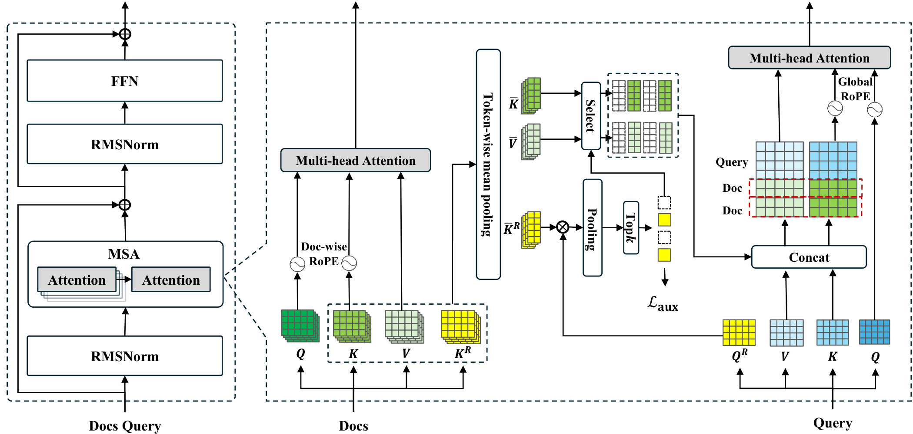
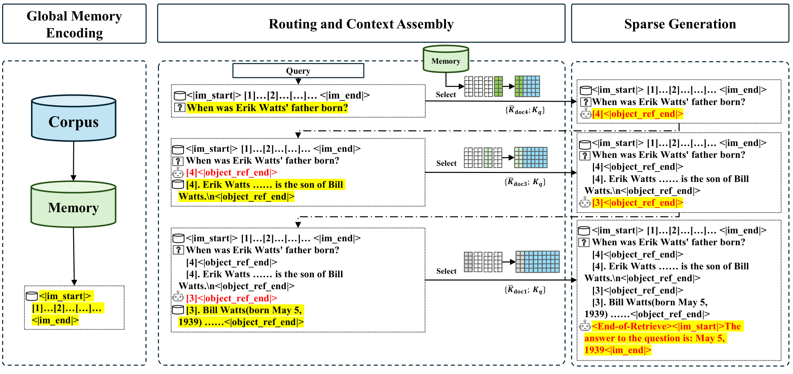
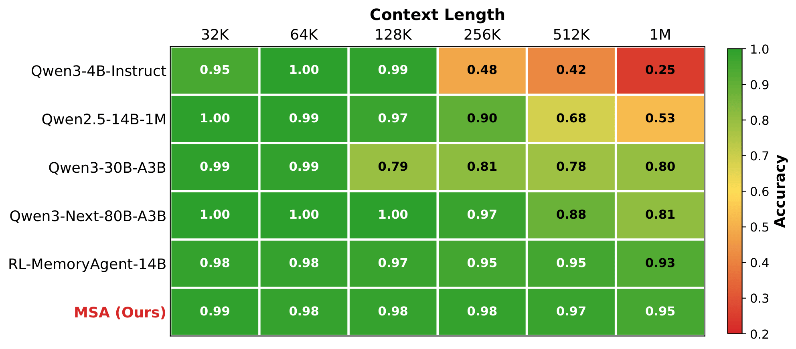

# MSA：Memory Sparse Attention - MSA 的亿级 Token 端到端可训练记忆框架 

*一个可扩展、端到端可训练的隐式记忆框架，支持 1 亿 token 上下文*

[**arXiv**](https://arxiv.org/abs/2603.23516) • [**Zenodo**](https://zenodo.org/records/19103670)

[](https://huggingface.co/EverMind-AI/MSA-4B) [](https://opensource.org/licenses/MIT) [](https://github.com/EverMind-AI) [](https://github.com/EverMind-AI/evermemos)

## 📝 摘要

长期记忆是通用智能的基础，但**全注意力**的计算瓶颈将大多数大语言模型的**有效上下文长度**限制在 **128K–1M**。现有方案——混合线性注意力、固定大小的状态记忆（如 RNN）、以及 **RAG/智能体**等外部存储——要么在极端长度下精度快速下降、延迟持续增长，要么缺乏端到端可微性或动态记忆管理能力，要么需要复杂的工程流水线。我们提出了**记忆稀疏注意力（MSA）**：一个**端到端可训练、可扩展的稀疏隐式状态记忆**框架。核心思路包括：

- **可扩展的稀疏注意力** + **文档级 RoPE**（并行/全局），在训练和推理中均实现**近线性复杂度**；
- **KV 缓存压缩**搭配**记忆并行**推理引擎，在 **2×A800** GPU 上实现 **1 亿 token** 吞吐；
- **记忆交织**机制，支持跨分散记忆片段的多轮、多跳推理。

在长上下文问答和 NIAH（大海捞针）基准测试中，**MSA** 超越了同骨干 RAG、顶尖 RAG 方案和领先的长上下文模型。在前所未有的 **16K→1 亿 token** 范围内，MSA 仅有**不到 9%** 的性能下降，为**将记忆容量与推理能力解耦**提供了一条可行路径。

> **从 16K 扩展到 1 亿 token**：MSA 将 top-k 选择与稀疏注意力融合，在推理时允许文档解耦的同时保持端到端可微。在 MS MARCO 上，MSA 性能下降**不到 9%**，并展现出强大的外推能力。
> *部分基线曲线因上下文长度限制而提前结束。*


*图 1：MSA 在超长上下文下的可扩展性*

---

## ✨ 核心贡献

- **记忆稀疏注意力（MSA）**：一个**端到端可训练**的**可扩展稀疏注意力**层，结合**文档级 RoPE**，实现 **O(L)** 复杂度，从 **16K→1 亿 token** 性能下降**不到 9%**。
- **KV 缓存压缩 + 记忆并行**：分层存储（路由键驻留 GPU、内容 K/V 存放 CPU），分布式打分，按需传输，在 **2×A800** 上实现 **1 亿 token** 推理。
- **记忆交织**：自适应交替执行"生成式检索 → 上下文扩展 → 生成"，大幅提升跨文档**多跳推理**能力。
- **全面评测**：MSA 在长上下文问答和 NIAH 基准上超越同骨干 RAG、顶尖 RAG 方案和领先长上下文模型，在大规模下展现出更优的**稳定性**和**准确率**。

---

## 🧩 整体设计

### 架构

MSA 将**检索与生成**融合到一个可微的闭环中。文档隐式状态（**K/V/Kᵣ**）通过**分块均值池化**进行压缩。**路由投影器**利用余弦相似度计算相关性（先对注意力头取均值，再对 token 取最大值），选出 **Top‑k 文档**，然后将其**压缩后的 K/V** 与查询的本地 **K/V** 拼接，用于自回归解码。路由仅作用于**上层**；下层保持**独立文档处理**，实现层级对齐。

- **并行（文档级）RoPE**：每个文档的位置从 0 开始重置，避免**短训练、长推理**之间的位置漂移，使 64k 训练能外推到 1 亿。
- **全局 RoPE（活跃上下文）**：查询的起始索引**偏移 k**（Top‑k 检索块数），保持因果顺序：*背景 → 查询 → 生成*。

**图 2：MSA 层（稀疏注意力 + 文档级 RoPE）**


*图 2：记忆稀疏注意力层与并行/全局 RoPE*

---

### 推理流水线

MSA 采用**三阶段**流水线（图 3）：

1. **全局记忆编码（离线）**：对语料进行前向计算，缓存分块池化后的 **(K̄, V̄, K̄ᵣ)**。
2. **在线路由与上下文组装**：将查询投影为 **Qᵣ**，与 **K̄ᵣ** 匹配选出 **Top‑k**，然后仅加载选中的 **K̄/V̄** 并与本地上下文拼接。
3. **稀疏生成**：在**稀疏上下文**上进行自回归生成。

**记忆并行**将 **K̄ᵣ** 分片到多个 GPU（广播查询 → 本地打分 → 全局归约）。内容 **K̄/V̄** 存放在主机内存中，被选中时**异步拉取**——在 **1 亿 token** 部署下兼顾**显存**与**吞吐**。

**图 3：三阶段推理与记忆交织**


*图 3：离线编码 → 在线路由 → 稀疏生成；可选多轮交织用于多跳推理*

---

## 🚀 实验结果

> **实验设置**
> **问答**：9 个数据集（MS MARCO v1、NQ、DuReader、TriviaQA(10M)、NarrativeQA、PopQA、2WikiMultiHopQA、HotpotQA、MuSiQue），记忆库规模 **277K→1000 万 token**，评测指标：**LLM 评分（0–5）**。
> **NIAH (RULER)**：8 个子任务，**32K→100 万 token**，报告平均准确率。
> **骨干模型**：Qwen3‑4B‑Instruct‑2507。对比同骨干 RAG 和顶尖 RAG 方案（KaLMv2 + 大模型生成器，可选重排序）。

### 表 2：MSA 对比同骨干 RAG（Qwen3‑4B）

**总结**：平均得分 **3.760**，相比标准 RAG 提升 **+16.0%**，相比 RAG+重排序提升 **+11.5%**，相比 HippoRAG2 提升 **+14.8%**（均取各方案最优 @k）；在同骨干组中，MSA 在除 NarrativeQA 外的所有数据集上领先。


| 数据集 | Token 数 | Qwen3-4B R@1 | R@5 | R@10 | Qwen3-4B (RR) R@1 | R@5 | R@10 | HippoRAG2 R@1 | R@5 | R@10 | MSA (自适应) |
|---------|--------|--------------|------|-------|----------------------|------|-------|------------------|------|--------|----------------|
| MS MARCO v1 | 7.34M | 2.893 | 3.011 | 3.005 | 2.934 | <u>3.032</u> | 3.017 | 2.676 | 3.005 | 3.019 | **4.141** |
| Natural Questions | 1.47M | 3.452 | 3.374 | 3.297 | <u>3.494</u> | 3.408 | 3.385 | 3.338 | 3.389 | 3.374 | **3.545** |
| DuReader | 277K | 3.726 | 3.579 | 3.594 | <u>3.848</u> | 3.618 | 3.607 | 2.941 | 3.485 | 3.415 | **4.155** |
| TriviaQA (10M) | 10M | 4.133 | 4.414 | 4.273 | 4.313 | 4.375 | 4.391 | 4.188 | <u>4.430</u> | 4.367 | **4.621** |
| NarrativeQA | 538K | 1.611 | 2.567 | 2.860 | **3.638** | 3.492 | <u>3.536</u> | 1.959 | 2.628 | 2.655 | 3.395 |
| PopQA | 1.18M | 2.959 | 3.273 | 3.299 | <u>3.315</u> | 3.264 | 3.266 | 3.111 | 3.249 | 3.249 | **3.433** |
| 2WikiMultiHopQA | 722K | 1.065 | 3.055 | 3.136 | 1.187 | 3.057 | 3.159 | 1.045 | 3.180 | <u>3.330</u> | **4.280** |
| HotpotQA | 1.35M | 2.252 | 3.582 | 3.787 | 2.642 | 3.990 | <u>4.022</u> | 3.230 | 3.770 | 3.970 | **4.061** |
| MuSiQue | 1.41M | 0.936 | 1.752 | 1.928 | 1.144 | 1.960 | 1.965 | 1.020 | 1.907 | <u>2.095</u> | **2.211** |
| **平均** | — | 2.559 | 3.179 | 3.242 | 2.946 | 3.355 | <u>3.372</u> | 2.612 | 3.227 | 3.275 | **3.760** |

*表 2：同骨干 RAG 对比 MSA（@1/@5/@10 vs MSA @自适应）*

---

### 表 3：MSA 对比顶尖 RAG（大骨干模型）

**总结**：对比 **KaLMv2+Qwen3‑235B** 和 **KaLMv2+Llama‑3.3‑70B**（有/无重排序），MSA 在 **4/9** 个数据集上取得最高分，平均得分 **3.760**，相对于各最强配置分别提升 **+7.2%**、**+5.0%**、**+10.7%** 和 **+5.4%**。在少数数据集（如 MuSiQue）上的差距主要源于参数量和固有推理能力的差异。


| 数据集 | KaLMv2 + Qwen3‑235B R@1 | R@5 | R@10 | Qwen3‑235B (RR) R@1 | R@5 | R@10 | KaLMv2 + Llama‑3.3 R@1 | R@5 | R@10 | Llama‑3.3 (RR) R@1 | R@5 | R@10 | MSA (自适应) |
|---------|---------------------------|------|-------|--------------------------|------|-------|------------------------------|------|--------|-------------------------|------|--------|----------------|
| MS MARCO v1 | 2.846 | <u>3.028</u> | 3.027 | 2.886 | 3.020 | 2.995 | 2.649 | 2.904 | 2.919 | 2.881 | 2.955 | 2.952 | **4.141** |
| Natural Questions | <u>3.711</u> | 3.670 | 3.694 | 3.621 | 3.610 | 3.645 | 3.675 | 3.674 | 3.662 | **3.756** | 3.665 | 3.647 | 3.545 |
| DuReader | 4.044 | 3.991 | 3.978 | 3.973 | 3.932 | 3.891 | <u>4.051</u> | 3.846 | 3.742 | 3.967 | 3.776 | 3.780 | **4.155** |
| TriviaQA (10M) | 4.367 | 4.656 | 4.578 | 4.492 | 4.320 | 4.555 | 4.273 | **4.740** | <u>4.719</u> | 4.547 | 4.703 | 4.695 | 4.621 |
| NarrativeQA | 1.413 | 2.130 | 2.427 | 3.212 | **3.427** | 3.375 | 1.290 | 2.123 | 2.382 | 3.150 | 3.263 | 3.317 | <u>3.395</u> |
| PopQA | 2.810 | 3.347 | <u>3.396</u> | 3.268 | 3.380 | 3.376 | 2.787 | 3.298 | 3.305 | 3.337 | 3.384 | 3.362 | **3.433** |
| 2WikiMultiHopQA | 2.646 | 3.579 | 3.582 | 1.855 | 3.381 | <u>3.583</u> | 1.339 | 3.263 | 3.445 | 1.651 | 3.332 | 3.541 | **4.280** |
| HotpotQA | 3.497 | 4.090 | **4.225** | 3.341 | 4.141 | 4.194 | 3.070 | 3.896 | 4.127 | 3.428 | 4.145 | <u>4.203</u> | 4.061 |
| MuSiQue | 1.988 | 2.462 | **2.647** | 1.801 | 2.522 | 2.605 | 1.704 | 2.317 | 2.258 | 1.895 | 2.462 | <u>2.614</u> | 2.211 |
| **平均** | 3.036 | 3.439 | 3.506 | 3.161 | 3.526 | <u>3.580</u> | 2.760 | 3.340 | 3.396 | 3.179 | 3.521 | 3.568 | **3.760** |

*表 3：顶尖 RAG 方案（强检索器 + 大生成器 + 可选重排序）对比 MSA*

---

### 图 4：RULER NIAH 稳定性（32K→100 万）

**总结**：MSA 在 **100 万 token** 下仍保持 **94.84%** 的准确率。未经改动的骨干模型在超过 **128K** 后急剧下降（**100 万时仅 24.69%**）。混合线性注意力长上下文模型在 **≥128K/256K** 时明显退化。外部记忆智能体（如 RL‑MemoryAgent‑14B）虽然较为稳定，但**绝对准确率**更低，衰减幅度也大于 MSA。


*图 4：准确率随上下文长度的变化（越高越好）*

---

## 实现说明

- **训练**：1589.5 亿 token 持续预训练，使用**辅助路由损失**，随后进行两阶段 SFT（**8k→64k** 课程学习）。
- **消融实验**（论文表 4）：课程扩展、记忆交织、持续预训练和注入原始文本均有显著贡献；移除它们会导致 **5%–37%** 不等的性能下降。

---

## 🚀 快速开始

> 完整说明（项目结构、支持的基准测试等）请参见 [**QUICK_START.md**](./QUICK_START.md)。

**1. 安装**

```bash
conda create -n msa python=3.12 -y && conda activate msa
pip install -r requirements.txt
pip install flash-attn==2.7.4.post1 --no-build-isolation
```

**2. 下载模型**

```bash
mkdir ckpt
huggingface-cli download --resume-download EverMind-AI/MSA-4B --local-dir ckpt/MSA-4B
```

**3. 下载基准数据**

基准数据托管在 [EverMind-AI/MSA-RAG-BENCHMARKS](https://huggingface.co/datasets/EverMind-AI/MSA-RAG-BENCHMARKS)，首次运行时会自动下载到 `data/` 目录。

**4. 运行**

```bash
# 在基准测试上运行推理
bash scripts/run_benchmarks.sh eval_benchmark

# 计算 LLM 评分
bash scripts/calculate_llm_score.sh eval_benchmark
```

---

## 引用

```bibtex
@misc{chen2026msamemorysparseattention,
      title={MSA: Memory Sparse Attention for Efficient End-to-End Memory Model Scaling to 100M Tokens},
      author={Yu Chen and Runkai Chen and Sheng Yi and Xinda Zhao and Xiaohong Li and Jianjin Zhang and Jun Sun and Chuanrui Hu and Yunyun Han and Lidong Bing and Yafeng Deng and Tianqiao Chen},
      year={2026},
      eprint={2603.23516},
      archivePrefix={arXiv},
      primaryClass={cs.CL},
      url={https://arxiv.org/abs/2603.23516},
}
```

### 致谢
本仓库及文档页面由 MSA 作者团队维护。如需了解项目最新动态，请访问**主页**：https://evermind.ai/
