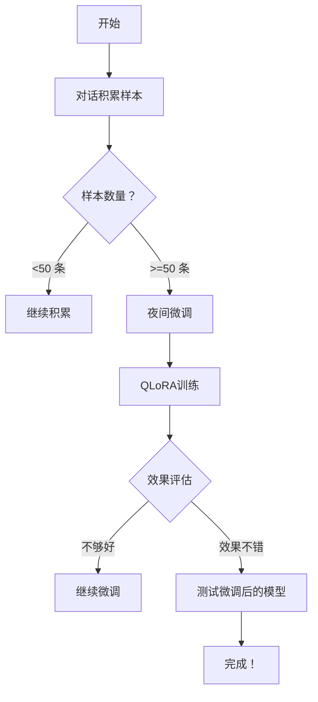

# 🧠 模型蒸馏 + QLoRA微调

## 📋 完整流程



---

## 📦 文件清单

| 文件 | 说明 |
|------|------|
| `model_distillation.py` | 模型蒸馏系统（积累经验） |
| `conversation_to_samples.py` | 对话转样本脚本 |
| `night_finetune_scheduler.py` | 夜间微调调度器 |
| `finetune_qwen35_qlora.py` | QLoRA微调脚本（参考） |

---

## 🚀 使用步骤

### 阶段1：积累经验（现在就可以开始！）

```bash
# 1. 运行对话转样本脚本
python conversation_to_samples.py

# 2. 用模型蒸馏系统积累更多样本
python -c "
from model_distillation import ModelDistillationSystem
from simple_llm_client_omlx import SimpleLLMClient

teacher = SimpleLLMClient(api_key='omlx')
student = MockModel()  # 可以用小模型模拟

distiller = ModelDistillationSystem(teacher, student)
result = distiller.query('如何优化Python代码？')
"

# 3. 查看样本统计
ls -lh ~/yuanfang/finetuning_data/all_samples.jsonl
```

---

### 阶段2：夜间微调（自动运行）

```bash
# 1. 设置定时任务
crontab -e

# 添加以下内容：
*/10 23-6 * * * /Users/sxliuyu/YuanFang/night_finetune_scheduler.py

# 2. 运行一次测试
python night_finetune_scheduler.py

# 3. 查看样本统计
cat ~/yuanfang/finetuning_data/finetune.log | tail -20
```

---

### 阶段3：QLoRA微调（晚上11点 - 早上7点）

```bash
# 准备数据文件
# 确保 ~/yuanfang/finetuning_data/all_samples.jsonl 有50+条样本

# QLoRA微调（Mac Mini上运行）
python -m mlx_lm.tuner.finetune \
    --model mlx-community/Qwen3.5-2B-MLX-4bit \
    --lora_rank 8 \
    --learning_rate 1e-4 \
    --batch_size 2 \
    --epochs 5 \
    --data ~/yuanfang/finetuning_data/all_samples.jsonl

# 或者用更简单的命令（根据实际API）
mlx-lm finetune \
    --model mlx-community/Qwen3.5-2B-MLX-4bit \
    --lora_rank 8 \
    --data ~/yuanfang/finetuning_data/all_samples.jsonl

# 4. 测试微调后的模型
python -c "
from simple_llm_client_omlx import SimpleLLMClient

client = SimpleLLMClient(api_key='omlx')
# 加载微调后的模型路径
"
```

---

## 📊 预期效果

| 样本量 | 效果 |
|--------|------|
| **50-100条** | 能看到一些效果（简单问题） |
| **100-500条** | 明显改善（一般问题） |
| **500-1000条** | 效果很好（复杂问题） |
| **1000+条** | 接近原始大模型 |

---

## 💡 关键点

1. **不用等** - 现在就可以积累经验
2. **小模型就能跑** - QLoRA只需4-6GB内存
3. **自动积累** - 夜间自动运行，不用手动操作
4. **平滑过渡** - 慢慢从小模型切换到微调后的模型

---

## 🎯 下一步建议

1. ✅ **现在就开始** - 用 `model_distillation.py` 积累经验
2. ⏳ **积累100条** - 达到50条即可开始微调
3. 🌙 **晚上运行** - 定时任务自动积累 + 微调
4. ✨ **测试效果** - 对比微调前后的回答

---

## ⚠️ 注意事项

1. **API key** - 确保 `OMLX_API_KEY` 已设置
2. **显存充足** - Mac Mini 8GB统一内存就够
3. **电量充足** - 夜间微调建议插电
4. **备份数据** - 定期备份 `~/yuanfang/finetuning_data`

---

## 📝 日志查看

```bash
# 查看微调日志
tail -n 20 ~/yuanfang/finetuning_data/finetune.log

# 查看样本统计
wc -l ~/yuanfang/finetuning_data/all_samples.jsonl

# 查看最近10个样本
head -20 ~/yuanfang/finetuning_data/all_samples.jsonl | python -m json.tool
```

---

**开始时间：2026-04-21 17:58**  
**目标：积累100条样本 + QLoRA微调**
